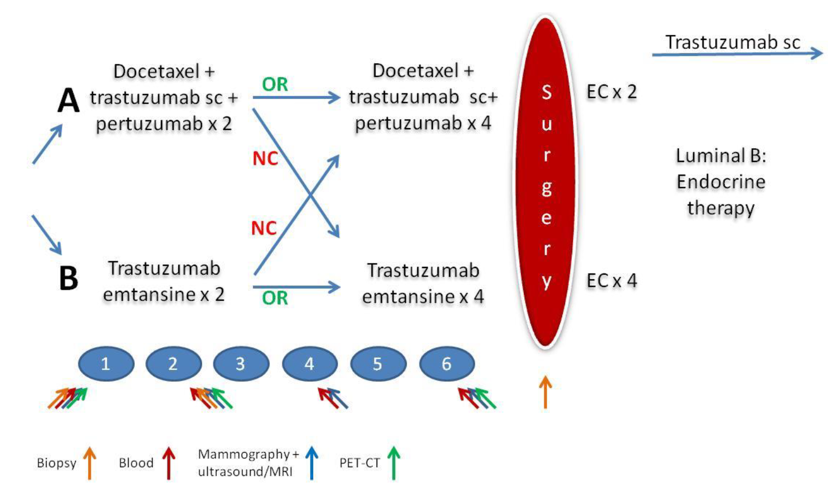

# 🧬 Multi-omic Profiling of HER2-Positive Breast Cancer

This repository contains the code and workflows used for analyses presented in the manuscript:  

> **“Multi-omic Profiling Reveals Predictive Biomarkers of Response to Antibody-Drug Conjugates in HER2-Positive Breast Cancer.”**

---

-  PREDIX HER2 trial (Hatschek T et al; JAMA Oncol. 2021)

<div align="center">
  
</div>


Data pre-processing
-----------

-   RNA-seq: nf-core ranseq
-   WES: nf-core sarek/hlatyping, PureCN best practices, GISTIC2.0, HLALOH, pVACseq, TcellExtrect  
-   CUT-seq: GATK copy number pipeline, GISTIC2.0
-   Proteomics: QC 
-   Xenium: QC, data integration, cluster/subcuster
-   Digital image: FLOCK

Multi-omics metrics collection
-----------

-  RNA-seq: DEG, transcriptomic metrics
-  WES: genomic metrics
-  Proteogenomic analysis

Figure
-----------
-  Figure1-7
-  FigureS1-9

ML pipeline
-----------

Custom integrative ML pipeline is available here: https://github.com/gmanikis/integrative_AI

nf-core workflow
------------

The nf-core pipelines can be set up based on: https://nf-co.re/pipelines/

```
# For example, launch the RNAseq pipeline
nextflow run nf-core/rnaseq \
    --input samplesheet.csv \
    --output ./results/ \
    --genome GRCh38 \
    -profile singularity
```

Quick start
-----------


